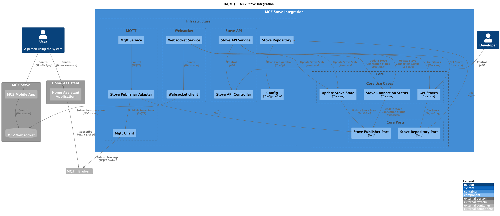

# MCZ Stove gateway to MQTT

This is a gateway to connect a MCZ pellet stove to a MQTT broker.

The connection is done via websockets from MCZ servers.

It's possible to connect multiple stoves to the same broker.

## Architecture

This project use hexagonal architecture. The core is the domain, where the business rules are implemented. The adapters
are the interfaces to the external world. The application is the glue between the domain and the adapters.

[](https://raw.githubusercontent.com/luizalabs/mcz-stove-gateway-to-mqtt/main/docs/architecture.png)

## Configuration

Copy the file `config.example.yml` to `config.yml` and fill the fields with your data.

```yaml
setup:
  debug: false
mqtt:
  url: mqtt://localhost:1883
  username: user
  password: password
  mqttTopicPath: MczStove
ws:
  url: http://app.mcz.it:9000
stoves:
  - serialNumber: 123456789
    macAddress: AABBCCDDEEFF
```

## Installation

### From source

```bash 
npm install
npm run start
```

### From docker

I need to create the docker image and push it to a registry.
Instead of that, you can build the image locally.

## Home assistant Integration

Go to addon into this repository and follow the instructions.
[Addon](../hassio-mcz-maestro)

## Development

You can simulate the stove without a real connection to the MCZ servers.
Run the server with the command

```bash
npm run start:api
```

Go to [localhost:3000](http://localhost:3000/api) and you can use the stove API

# License

This project is licensed under the MIT License 
