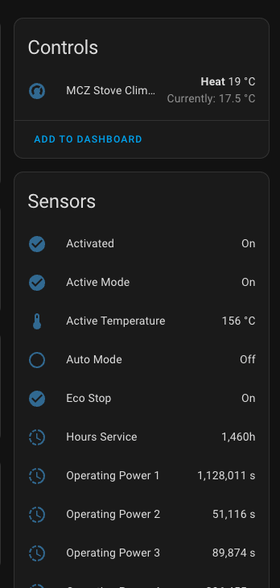
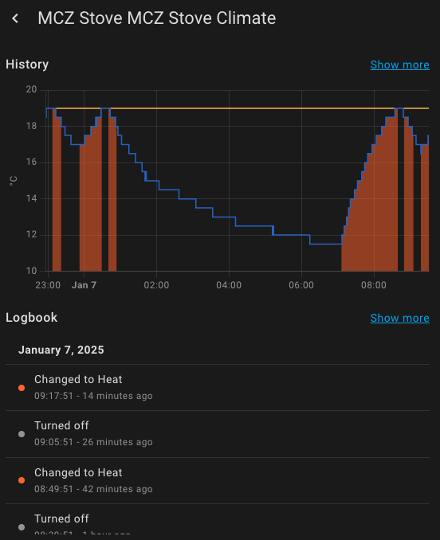

# MCZ Maestro Stove Integration for Home Assistant

![Supports aarch64 Architecture][aarch64-shield]
![Supports amd64 Architecture][amd64-shield]
![Supports armhf Architecture][armhf-shield]
![Supports armv7 Architecture][armv7-shield]
![Supports i386 Architecture][i386-shield]

[aarch64-shield]: https://img.shields.io/badge/aarch64-yes-green.svg

[amd64-shield]: https://img.shields.io/badge/amd64-yes-green.svg

[armhf-shield]: https://img.shields.io/badge/armhf-no-red.svg

[armv7-shield]: https://img.shields.io/badge/armv7-yes-green.svg

[i386-shield]: https://img.shields.io/badge/i386-no-red.svg

Addon to manage MCZ Maestro Stove in Home Assistant.

Go to the [app](../app) repository to see the architecture and how it works.

This application need MQTT to work. It setup MQTT discovery and publish the stove information.

_It's still in development._

## Backlog

- [ ] Add missing attributes from the stove
- [ ] Add Fan information
- [x] Control the stove from HA : turn on/off
- [x] Control the stove from HA : Change the target temperature
- [ ] Control the stove from HA : Fan control
- [ ] Compute the consumption of pellets
- [ ] Use MQTT configuration from HA

## Addon in Home Assistant

